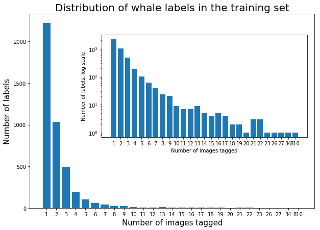
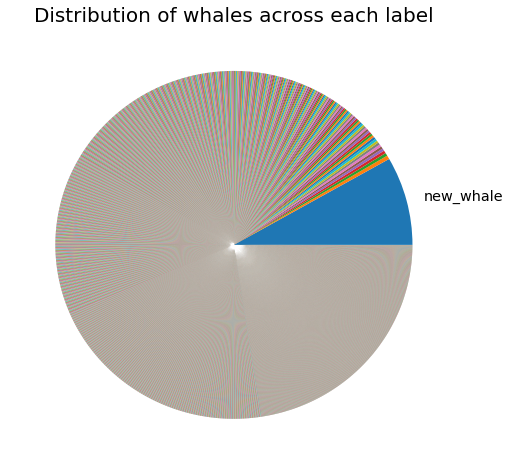
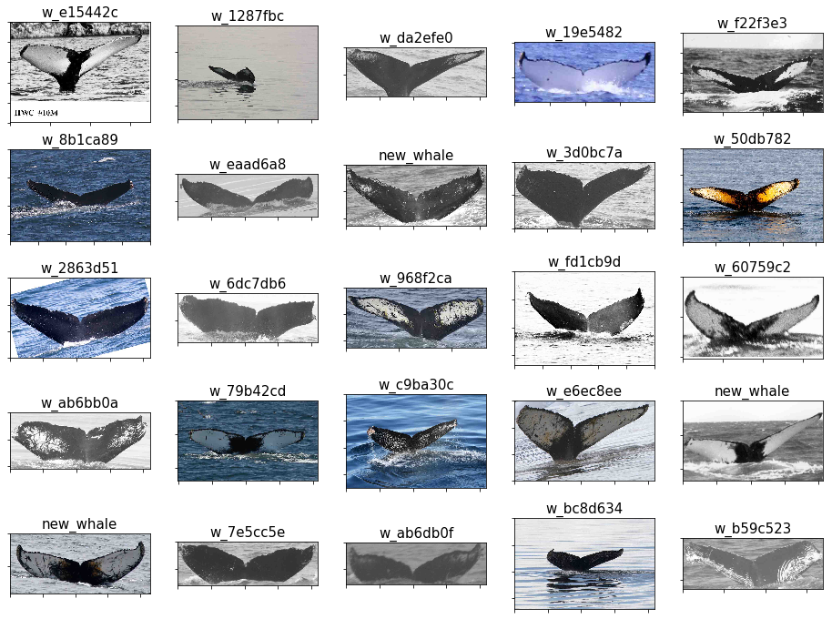

# Humpback Whale Image Classifier Kaggle Competition


```python
# Reload modules before executing user code
%reload_ext autoreload
# Reload all modules (except those excluded by %aimport)
%autoreload 2
# Show plots within this notebook
%matplotlib inline
```

## Dataset Exploration

(This section of our analysis borrows heavily on the work of others, as we ourselves are learning. In particular, we heavily borrow from Lex Toumbourou's kernel "Humpback Whale ID: Data and Aug Exploration" found __[here](https://www.kaggle.com/lextoumbourou/humpback-whale-id-data-and-aug-exploration/notebook)__.)

The first step with any kind of analysis is to understand your dataset. Given the question you wish to answer with your data, you need to make sure you can actually take the steps required to arrive at the answer. In this Kaggle competition, we are given a dataset of 9,850 images containing humpback whales and are asked to build a classifier to identify which whale an image contains (or identify new whales). These images in the training set come with labels identifying the whales in the images. Simple, right?

### Number of whales in the dataset

Well, not necessarily. You might think that with a roughly 10K image dataset you'd have plenty of images for each whale. But the first thing to check is just how many whales we are being asked to differentiate between. There's a big difference between 30 whales and 3000 whales. So let's check how many whales are in our dataset by loading in the training dataset labels and check the number of individual labels.


```python
# Set the path where our data lives:
PATH = 'download/'
train_csv = '{}train.csv'.format(PATH)

import pandas as pd
import numpy as np

# Read in the training set metadata:
train_df = pd.read_csv(train_csv, na_filter=False)
```

Now that we have our training set metadata we can examine the labels we are working with: what they look like, how many there are, how are they distributed, etc. Let's first look at what the labels look like.


```python
# The Id column of our metadata contains the labels:
train_df.Id.head(20)
```


    0     w_e15442c
    1     w_1287fbc
    2     w_da2efe0
    3     w_19e5482
    4     w_f22f3e3
    5     w_8b1ca89
    6     w_eaad6a8
    7     new_whale
    8     w_3d0bc7a
    9     w_50db782
    10    w_2863d51
    11    w_6dc7db6
    12    w_968f2ca
    13    w_fd1cb9d
    14    w_60759c2
    15    w_ab6bb0a
    16    w_79b42cd
    17    w_c9ba30c
    18    w_e6ec8ee
    19    new_whale
    Name: Id, dtype: object


Ok, so let's notice something here. We looked at the first 20 labels, and they're all different, except for 2 whales that are considered "new" and therefore not associated with the individually tagged whales (tagged by whoever did the labeling). So how many labels are there?


```python
# We can use numpy's unique function to easily get at this question:
print(len(np.unique(train_df.Id)))
```

    4251


Holy moly. So there are 4,251 different whale labels (4,250 total whales if you don't count "new_whale")! Naïvely you might think that means there'll be 9850/4251 = 2.3 images per whale. But is that really the distribution?


```python
from collections import Counter
whale_dist = Counter(train_df['Id'].value_counts().values)
print(sorted(whale_dist.items()))
```

    [(1, 2220), (2, 1034), (3, 492), (4, 192), (5, 102), (6, 61), (7, 40), (8, 23), (9, 21), (10, 9), (11, 7), (12, 7), (13, 9), (14, 5), (15, 4), (16, 5), (17, 4), (18, 2), (19, 2), (20, 1), (21, 3), (22, 3), (23, 1), (26, 1), (27, 1), (34, 1), (810, 1)]


```python
import matplotlib.pyplot as plt

N = len(whale_dist)
vals = list(whale_dist.values())
keys = list(whale_dist.keys())

# Plot main bar graph:
fig, ax1 = plt.subplots(figsize=(10,7))
plt.title('Distribution of whale labels in the training set', fontsize=20)
ax1.bar(range(N), vals, align='center')
ax1.set_xticks(range(N))
ax1.set_xticklabels(keys)
ax1.set_xlabel('Number of images tagged', fontsize=15)
ax1.set_ylabel('Number of labels', fontsize=15)

# Plot the inset:
left, bottom, width, height = [0.32, 0.4, 0.56, 0.4]
ax2 = fig.add_axes([left, bottom, width, height])
ax2.bar(range(N), vals, align='center')
ax2.set_xticks(range(N))
ax2.set_xticklabels(keys)
ax2.set_yscale('log')
ax2.set_xlabel('Number of images tagged', fontsize=10)
ax2.set_ylabel('Number of labels, log scale', fontsize=10)
```


    Text(0,0.5,'Number of labels, log scale')





This plot is the visual representation of the Counter object printed out above it. Inset is the same plot on a log scale to help illustrate low end of the Y-axis. This is very interesting -- it says that there are 2,220 whales that have just 1 image containing its tag; 1,034 whales have 2 images containing its tag; and so on all the way down to one tag containing 810 associated images! Which one is it? You might have guessed it by now but let's be sure:


```python
print(train_df['Id'].value_counts())
```

    new_whale    810
    w_1287fbc     34
    w_98baff9     27
    w_7554f44     26
    w_1eafe46     23
    w_fd1cb9d     22
    w_693c9ee     22
    w_ab4cae2     22
    w_43be268     21
    w_73d5489     21
    w_987a36f     21
    w_f19faeb     20
    w_9b401eb     19
    w_95874a5     19
    w_c0d494d     18
    ...
    w_a4678de    1
    w_35eb420    1
    w_fa69bb8    1
    w_f37508c    1
    w_f283381    1
    w_e5d6443    1
    w_64d8a6d    1
    w_8201c3f    1
    w_62ec01b    1
    w_f3865d6    1
    w_a402e24    1
    w_8ab8687    1
    w_b2aa351    1
    w_98b57a1    1
    w_8e4fa60    1
    Length: 4251, dtype: int64


As expected, new_whale is the category with the overwhelming majority of tags. So we have a big problem...if we want to train a classifier to identify each of these whales, we'll need a lot more images for each whale! Even 34 is a low number, so we are going to want to augment our data in order to fill this out more. To visualize this further, let's plot up a pie chart:


```python
# So many labels are unnecessary, just new_whale, so let's build the needed list:
labels = ['']*len(train_df['Id'].value_counts())
labels[0] = 'new_whale'

# Now plot the pie chart:
fig, ax = plt.subplots(figsize=(8,8))
_ , texts = ax.pie(train_df['Id'].value_counts(), labels=labels)
texts[0].set_size('x-large')  # Enlarge the label text for new_whale
_ = plt.title('Distribution of whales across each label', fontsize=20)
plt.show()
```





As you can see in the above pie chart, new_whale is really the **only** ID label that makes up a significant percentage (roughly 8.2% as it turns out) of the full training data. 

Later, we'll discuss how we'll go about doing the augmentation of this dataset. For now, let's continue our exploration of the training data to see if there are other issues to consider.

## Examining the images themselves

Now that we have identified our first issue of needing to augment our image dataset, we should examine the images themselves. If they don't share specific properties like size dimensions, color scheme, etc. then we may run into additional issues. Let's load in some images and see what we find!


```python
import matplotlib.image as mpimg

# Let's plot up the first 25 images in the training data set:
image_names = np.reshape([str(i) for i in train_df.Image[0:25]], (5,5))
image_id = np.reshape([str(j) for j in train_df.Id[0:25]], (5,5))
fig, axes = plt.subplots(5,5, figsize=(16,12))
for row in range(5):
    for col in range(5):
        img = mpimg.imread('{}train/{}'.format(PATH, image_names[row, col]))
        axes[row, col].imshow(img, cmap='gray')
        axes[row,col].set_title(image_id[row,col], fontsize=15)
        axes[row, col].xaxis.set_ticklabels([])
        axes[row, col].yaxis.set_ticklabels([])
```





So there's a number of things we can see from these first 25 images. First, they aren't all the same size dimensions. This implies we will either have to make a classifier that doesn't care about image size, or we'll have to standardize the dimensions of each image for proper comparison. 

Second, some of the images are in grayscale, but others are in color. That means our classifier will have to not care much about whether or not the image is in color, or we'll have to standardize all images to grayscale. It's likely a better approach to just test any given image for color, and then add the grayscaled version of it to the dataset as a separate image; this will help us in our augmentation step, since it adds more data to our sample. I'm not sure however if doing this will bias the classifier to misclassify whales in our sample that do not have originally have color if presented with a color version of the same whale.

Lastly, you can see the first image has a label section of sorts in the bottom portion of the image. The words in the label "HWC # 1034" doesn't seem to correlate with the whale's label. Having images with these arbitrary labels at the bottom could also further complicate things, though I am uncertain how we would go about removing them, especially since many of these labels (not shown in the figure) are very different.

## Grayscale images vs. color images

As illustrated above, some of the images in our dataset appear to be color, while others are in grayscale. So what are the statistics on this? Are most in color or in grayscale? Let's build a grayscale testing function and see:


```python
from PIL import Image

def is_gray_scale(img_path, num=0):
    """Thanks to Lex Toumbourou and Stack Overflow.
    
    This function will convert the image into RGB filters. If the image
    is grayscale, then it will have identical values in each filter. So
    we will loop through and check for pixel differences...if we hit a
    difference, stop since it's color and return 0. As such, grayscale
    images will take much longer depending on the image size, as all
    pixels must be tested.
    
    If you wish to test a large number of images in a loop, I added a num 
    value (with a commented out print statement) that can help you see
    where you are in the loop. This is useful in a terminal, as I have 
    never been able to get this to print in a notebook in real time 
    (hence the commenting out). 
    
    """
    im = Image.open(img_path).convert('RGB')
    #print(num+1)
    w,h = im.size   # Looping through each pixel in image and testing if r=b=g. If not, it's color.
    for i in range(w):
        for j in range(h):
            r,g,b = im.getpixel((i,j))
            if r != g != b: return 0    # If color, stop here and return 0
    return 1
```

When we test our data for color images or grayscale images, we have to be careful about bias. Because there are so many images (9850 total), it would take a very long time to test them all. So we can save time by pulling a random sample of them and using it to draw conclusions about the whole dataset. If the distribution of whales were roughly equal across all labels, we could be more comfortable testing from a completely random sample so long as it's large enough to capture whales across the distribution and not too small to potentially sample only a few labels.

However, we **don't** have an even distribution. A full 810/9850 x 100 = 8.2% of our images are of the "new_whale" category, while the next highest label is 34/9850 x 100 = 0.35% of the sample. Most whales in our sample have only 1 image, constituting 1/9850 x 100 = 0.01% of the sample. To help avoid bias, we recommend pulling from our largest label(s) at a percentage appropriate to make sure most labels are included but not over/under represented.

So we will make sure that 8.2% of our random sample is made up of whales with no ID. We could continue this for each other category, but given the small percentages of the others, that would be unnecessary. We will use 20% of our data to try and get a good representation of the dataset as a whole.


```python
import random
twenty_perc = round(0.20*len(train_df.Image))
num_new_whales = round(0.082*0.20*len(train_df.Image))
num_other_whales = twenty_perc - num_new_whales
gray_new_whales = [is_gray_scale('{}train/{}'.format(PATH, val), num=i) 
                      for i, val in enumerate(random.sample(
                          list(train_df.Image.loc[train_df.Id == 'new_whale']), num_new_whales))]
gray_other_whales = [is_gray_scale('{}train/{}'.format(PATH, val), num=i) 
                      for i, val in enumerate(random.sample(
                          list(train_df.Image.loc[train_df.Id != 'new_whale']), num_other_whales))]
total_gray = sum(gray_new_whales) + sum(gray_other_whales)
perc_gray = total_gray*100 / (num_new_whales + num_other_whales)
print(perc_gray)

# NOTE: I shouldn't need to use the random module, since pandas version 0.22.0 (which we are using)
#       has a .sample() method for Series and Dataframe objects, but for some reason it's not working
#       for me. So I used this workaround instead. Using .sample() and specifying the keyword n for number
#       of entries (e.g., n=num_new_whales) would be much cleaner.
```

    50.15228426395939


We find that our sub-sample of the data (20% given our time constraints) is 50.2% grayscale. We ran the entire sample outside of this notebook just to back up our claims that this is representative of the full sample, and we indeed found a value of 49.9% of the total data is grayscale. So in both cases, we obtained a value close to 50%, so about half of our training dataset is in color and half is in grayscale. This is useful for us to know when we go about our data augmentation later in this notebook.

A quick note: if our data's new_whale label subset is representative of the total distribution, then we would not have had to consider our random sample so carefully, as an overrepresentation would not have changed the overall outcome. Let's see if this was in fact the case, since this won't take too much computation time:


```python
gray_new_whale_only = [is_gray_scale('{}train/{}'.format(PATH, str(val)), num=i) 
                  for i, val in enumerate(train_df.Image.loc[train_df.Id == 'new_whale'])]
perc_gray_new = sum(gray_new_whale_only)*100 / len(gray_new_whale_only)
print(perc_gray_new)
```

    51.23456790123457


We can see here that the new_whale label does not feature any bias with regards to color/grayscale compared to the full dataset, as they both are approximately half color and half grayscale. So had we ignored the potential for overrepresentation, our statistics would not have changed. However, in this dataset, we had no reason to suspect this would be the case, and so the caution we used is the best course of action (in our opinion). If you have a sample where you already know this is the case, then by all means just take a random sample without trying to force relevant representation.

All in all, this is just a warning of the potential problems you can get when you test a subsample of your data to draw conclusions about the larger dataset, as over- (and under-) sampling a category can introduce a bias if that category is significantly different than the full dataset. In this case, our largest category is not different (with respect to image coloring) than the rest of the sample, so we were not in danger. But we checked anyway to be sure, and recommend this practice generally.

## Size distribution of our training set

(Coming soon)


```python

```
